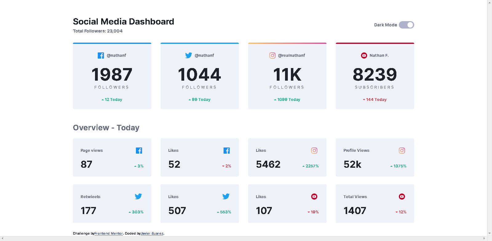

# Frontend Mentor - Social media dashboard with theme switcher solution

This is a solution to the [Social media dashboard with theme switcher challenge on Frontend Mentor](https://www.frontendmentor.io/challenges/social-media-dashboard-with-theme-switcher-6oY8ozp_H). Frontend Mentor challenges help you improve your coding skills by building realistic projects. 

## Table of contents

- [Overview](#overview)
  - [The challenge](#the-challenge)
  - [Screenshot](#screenshot)
  - [Links](#links)
- [My process](#my-process)
  - [Built with](#built-with)
  - [Continued development](#continued-development)
  - [Useful resources](#useful-resources)
- [Author](#author)

## Overview

### The challenge

Users should be able to:

- View the optimal layout for the site depending on their device's screen size
- See hover states for all interactive elements on the page
- Toggle color theme to their preference

### Screenshot

### Links

- Solution URL: [Add solution URL here](https://your-solution-url.com)
- Live Site URL: [Add live site URL here](https://your-live-site-url.com)

## My process

### Built with

- CSS custom properties
- Flexbox
- Mobile-first workflow

### Continued development

There's definitely a lot a need to improve in terms of my divs organization, I feel theres a couple that were not needed if I had planned better.

### Useful resources

- [Switch button tutorial](https://www.youtube.com/watch?v=uCjDIMADK0w) -I used this tutorial to make the switch button. I only changed the size and colors

## Author

- Github - [JavierSua](https://github.com/JavierSua)
- Frontend Mentor - [@JavierSua](https://www.frontendmentor.io/profile/JavierSua)

